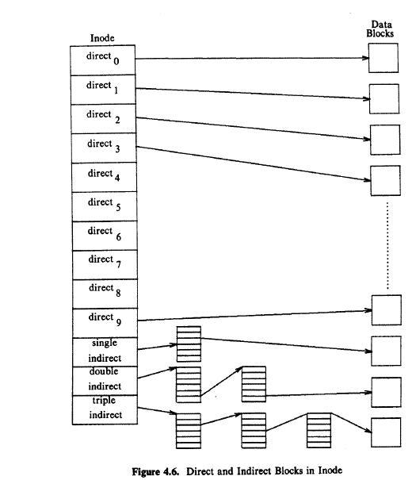

# Introduction
* Section 4.1 examines
the mode and how the kernel manipulates it,
* Section
4.3 investigates the structure of directories, the files that allow the kernel to
organize the file system as a hierarchy of files
* Section 4.4 presents the
algorithm for converting user file names to modes. Section 4.5 gives the structure
of the super block
* Sections 4.6 and 4.7 present the algorithms for assignment
of disk modes and disk blocks to files. 
* Section 4.8 talks about other file
types in the system, namely, pipes and device files.

# 4.1 Inodes
* Basic Contents of Disk Inode
     - Ownership
     - File type
    - Access Permissions
    - Last modifies
    - Last Accessed
    - Table of content
    - File size
    - Number of links to the file, representing the number of names the file has in the
    directory hierarchy

* The contents of a file change only when
writing it.
*  The contents of an inode change when changing the contents of a file or
when changing its owner, permission, or link settings.

>  in - core  copy of inode ?? pg 63 
http://prashantagmnnit.blogspot.com/2014/03/os-incore-inode-vs-disk-inode.html

> The in-core representation of the Mode differs from the disk copy as a result
of a change to the data in the mode, -->

 > The in-core representation of the file differs from the disk copy as a result of
a change to the file data,  -- >pg63

> Pointers to other in-core inodes. The kernel links inodes on hash queues and on
a free list in the same way that it links buffers on buffer hash queues and on the
buffer free list --> pg63

* Incore copy of Inode Content list
    -  is Locked
    -  Whether some process is waiting for inode to be unlocked.
    -  Inode Changed 
    -  File changed
    - Device no. of File System from which this inode is copied into Main Memory.
    - Inode Number
    - Refernce Count - Active instances of the file
    - Pointer to other incore inodes
* Inodes are very similar to buffer caches
    - lf a process attempts to access a file whose
Mode is not currently in the in-core inode pool, the kernel reallocates an in-core
inode from the free list for its use

* The kernel identifies particular inodes by their file system and mode number

* iget is similar to getblk of previous chapter

* Similar to getblk ,The kernel maps the
device number and mode number into a hash queue and searches the queue for the
inode 

* The iget algorithm returns a locked mode structure
with reference count 1 greater than it had previously been

# Structure of Regular file
* 2 strategies for storing file
    - contigeous
    - non contigeous

* In later approuch inode consist of the block numbers through out the memory where files are stored in chunk

* block Numbers in inode marked as direct and indirect

# 4.3 Directories

* A directory is a file whose data is a sequence of entries, each
consisting of an mode number and the name of a file contained in the directory

* Every directory contains
the file names dot and dot-dot ("." and "..") whose mode numbers are those of the
directory and its parent directory, respectively

* The kernel stores data for a directory just as it stores data for an ordinary file but the kernel reserves
exclusive right to write a directory, thus insuring its correct structure.

# 4.5 Super block

* The super block consists of the following fields:
    - the size of the file system,
    - the number of free blocks in the file system,
    - a list of free blocks available on the file system,
    - the index of the next free block in the free block list,
    - the size of the mode list,
    - the number of free inodes in the file system,
    - a list of free inodes in the file system,
    - the index of the next free Mode in the free mode list,
    - lock fields for the free block and free mode lists,
    - a flag indicating that the super block has been modified,

    

