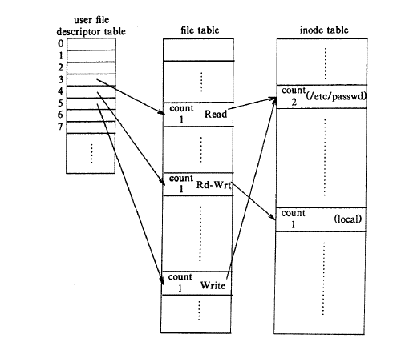

# File system Ds

* The User Descriptor Table

    - Every process has its own User Descriptor Table. This table is essentially an array of pointers to open file structures and other I/O object structures (such as pipes) currently in use by the process.

 

    - The array elements are numbered from 0 and files are referenced by using one of the array index numbers as a parameter to system calls such as read and write


* The System File Table
    
    - Each element in the User Descriptor Table is a pointer to a file structure in the System File Table.

    - The System File Table is a shared centralised data structure containing a file structure element for every file or I/O object that is currently in use in the system.

* Inode Table -

    - Each Entry in file table points to inode which stores that file


# 5.1 OPEN

* fd open(pathname, flags, modes);

* modes give the file permissions if the file is being created

* The
open system cal] returns an integer' called the user file

* The kernel searches the file system for the file name parameter using algorithm
namtei

* Allocates an entry in the file table for the open file.

*  The file table
entry contains a pointer to the mode of the open file and a field that indicates the
byte offset in the file where the kernel expects the next read or write to begin

* The kernel allocates an entry in a private table in the process u
area, called the user file descriptor table, and notes the index of this entry. 

* The
index is the file descriptor that is returned to the user. The entry in the user file
table points to the entry in the global file table.

     

     -  file descriptors index into a per-process file descriptor table maintained by the kernel,
     
     - that in turn indexes into a system-wide table of files opened by all processes, called the file table


    > Each open returns a file descriptor to the process, and
the corresponding entry in the user file descriptor table points to a unique entry in  the kernel file table even though one file ("/etc/passwd") is opened twice. ??

* The process can read or write the file "/etc/passwd" but only through file
descriptors 3 and 5 in the figure. 

* The first three user file descriptors (0, 1, and 2) are called the standard input,
standard output, and standard error file descriptors

# 5.2 READ

* number=read(fd, buffer, count)

* buffer is the address of a data
structure in the user process that will contain the read data on successful
completion of the call,

* count is the number of bytes the user wants to read, and
number is the number of bytes actually read

* The kernel gets the file table entry that corresponds to user descriptor table
 
*   Kernel sets the following fields so that is doesnot have to pass them as function parameters  

    Io Param | Description|
    ---------|----------|---------
    Mode | indicates read or write
    Count |count of bytes to read or write
    Offset|byte offset in file
    Address | target address to copy data, in user or kernel memory
    Flag| indicates if address is in user or kernel memory


* When a process invokes the read system call, the kernel locks the inode for the
duration of the call.

* see read algorithm fig 5.5

* In Below example first read will read from  0 offest the next from 20 offset n next from 1044 as after each read as the offset field of file table will be changed
    ```
        #include <fcritl.h>
        main()
        {
            int fd;
            char libuf[1024],bigbuf[1024];
            fd=open(letc/passwd", O_RDONLY);
            read(fd, libbuf, 20);
            read(fd, bigbuf, 1024);
            read (fd, lilbuf, 20);
        }


    ```


    >  3rd para on page 99 how is it advantageous ??

    > First 2 para of page 100 ??

* It would be unfair for the system to keep an mode locked from the
time a process opened the file until it closed the file, because one process could
keep a file open and thus prevent other processes from ever accessing it.

* If the file
was "/etc/passwd", used by the login process to check a user's password, then one
malicious (or, perhaps, just errant) user could prevent all other users from logging
in.

* To avoid such problems, the kernel unlocks the inode at the end of each system
call that uses it and not from time when file is opened to when file is closed 

